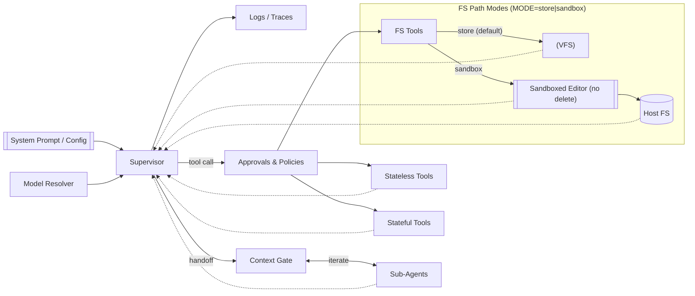

# deepagents
> Inspect-AI-native, CLI-first agents with typed state, tools, and rich traces.


[](https://github.com/cnm13ryan/deepagents/actions)
[](https://github.com/cnm13ryan/deepagents/actions)
[](https://app.codecov.io/gh/cnm13ryan/deepagents)
[](LICENSE)
[](https://pypi.org/project/deepagents/)
[](https://pypi.org/project/deepagents/)
[](https://github.com/cnm13ryan/deepagents/commits/inspect-ai-rewrite)

## Why deepagents?
Setting up practical LLM agents is slow: you fight glue code, logging, state, and tool orchestration. deepagents removes the overhead with an Inspect-AI-native, CLI-first workflow: one command to run; typed state (todos/files); built-in tools; transcripts and traces by default. Ship in minutes, not days.

## Key Features
- ✅ **CLI-first**: One command to run an agent or eval with Inspect
- ✅ **Inspect-native tools**: Todos + virtual filesystem (store or sandbox)
- ✅ **Optional standard tools**: Think, web_search, bash/python, web_browser, text_editor
- ✅ **Typed state**: Simple, explicit models backed by Inspect Store
- ✅ **Sub-agents**: Choose "handoff" (iterative control-flow) or "tool" (single-shot)
- ✅ **Traces & transcripts**: Rich logs and JSONL artifacts out of the box
- ✅ **Safe by default**: Approvals, quarantine filters, and sandbox file operations
- ✅ **Works offline**: Guaranteed "toy" example to validate setup in seconds

 

## Installation

### Prerequisites
- **Python**: 3.11 or later (tested on 3.12)
- **OS**: macOS or Linux

### Using uv (Recommended)
```bash
# Set cache directory (avoids re-downloading in restricted environments)
export UV_CACHE_DIR=.uv-cache

# Install dependencies
uv sync

# Verify installation
uv run python -c "import inspect_agents; print('deepagents OK')"
```

### Using pip/venv
```bash
# Create and activate virtual environment
python3.11 -m venv .venv
source .venv/bin/activate

# Install in editable mode
pip install -e .

# Verify installation
python -c "import inspect_agents; print('deepagents OK')"
```

## Quick Start

### Offline Test (No API Keys Required)
Create and run a toy agent to verify your setup:

```python
# quickstart_toy.py
import asyncio
from inspect_ai.agent._agent import AgentState, agent
from inspect_ai.model._chat_message import ChatMessageAssistant
from inspect_agents.agents import build_supervisor
from inspect_agents.run import run_agent

@agent
def toy_submit_model():
    async def execute(state: AgentState, tools):
        state.messages.append(
            ChatMessageAssistant(
                content="",
                tool_calls=[{"id": "1", "function": "submit", "arguments": {"answer": "DONE"}}],
            )
        )
        return state
    return execute

async def main():
    sup = build_supervisor(prompt="You are helpful.", tools=[], attempts=1, model=toy_submit_model())
    result = await run_agent(sup, "hello")
    print("Completion:", result.output.completion)

asyncio.run(main())
# Expected output: "Completion: DONE"
```

### CLI Usage
Basic evaluation with built-in tools:
```bash
uv run inspect eval examples/inspect/prompt_task.py -T prompt="Write a concise overview of LangGraph"
```

With optional tools enabled:
```bash
# Enable structured thinking
INSPECT_ENABLE_THINK=1 uv run inspect eval examples/inspect/prompt_task.py -T prompt="..."

# Enable web search (requires API key)
INSPECT_ENABLE_WEB_SEARCH=1 TAVILY_API_KEY=... uv run inspect eval examples/inspect/prompt_task.py -T prompt="..."
```

For prompts with special characters, use single quotes:
```bash
uv run inspect eval examples/inspect/prompt_task.py \
  -T 'prompt="Identify research about: Cultural traditions and scientific processes"'
```

### Provider Examples
```bash
# LM Studio
uv run python examples/inspect/run.py --provider lm-studio --model local-model "Your prompt"

# Ollama
uv run python examples/inspect/run.py --provider ollama --model llama3.1:8b "Your prompt"

# OpenAI (requires OPENAI_API_KEY)
uv run python examples/inspect/run.py --provider openai --model gpt-4o-mini "Your prompt"
```

## Advanced Usage

### Sub-agents Configuration
Define sub-agents in YAML and load programmatically:
```yaml
# inspect.yaml
supervisor:
  prompt: |
    You are a helpful supervisor. Use sub-agents when appropriate.
subagents:
  - name: researcher
    description: Focused web researcher that plans and cites sources
    prompt: Research the user's query. Plan, browse, then draft findings.
    mode: handoff
    tools: [web_search, write_todos, read_file, write_file]
    limits:
      - type: time
        seconds: 60
      - type: messages
        max: 8
    context_scope: scoped
    include_state_summary: true
```

```python
from inspect_agents.config import load_and_build
from inspect_agents.run import run_agent
import asyncio, yaml

cfg = yaml.safe_load(open("inspect.yaml"))
agent, tools, approvals = load_and_build(cfg)
result = asyncio.run(run_agent(agent, "start", approval=approvals))
print(getattr(result.output, "completion", "[no completion]"))
```

## Architecture



Fallback: `docs/diagrams/architecture_overview.png`

## Documentation
- **Getting Started**: `docs/getting-started/inspect_agents_quickstart.md`
- **Tools Reference**: `docs/tools/README.md`
- **Sub-agent Patterns**: `docs/guides/subagents.md`
- **Examples**: `examples/inspect/`
- **Open Questions**: `docs/open-questions.md`

## Project Status
- **Version**: 0.0.4 (repo) / 0.0.5 (PyPI)
- **Status**: Beta
- **Python**: 3.11+ (tested on 3.12)
- **Roadmap**: [GitHub Milestones](https://github.com/cnm13ryan/deepagents/milestones) | [Projects](https://github.com/cnm13ryan/deepagents/projects)

## Contributing
See [CONTRIBUTING.md](CONTRIBUTING.md) for guidelines.

### Quick Setup for Contributors
```bash
# Install with dev dependencies
python3.11 -m venv .venv && source .venv/bin/activate
pip install -e '.[dev,testing,utilities]'

# Run tests (ensure local Inspect-AI src is visible)
export PYTHONPATH=src:external/inspect_ai/src
pytest -q tests/unit/inspect_agents

# Lint and format
ruff check && ruff format
```

## Support
- **Questions**: [GitHub Discussions](https://github.com/cnm13ryan/deepagents/discussions)
- **Bugs & Features**: Open an [Issue](https://github.com/cnm13ryan/deepagents/issues) with repro steps

## License & Acknowledgments
- Licensed under [MIT](LICENSE)
- Thanks to the Inspect-AI project and ecosystem
- Inspired by CLI-first DX from projects like Bun and Supabase
