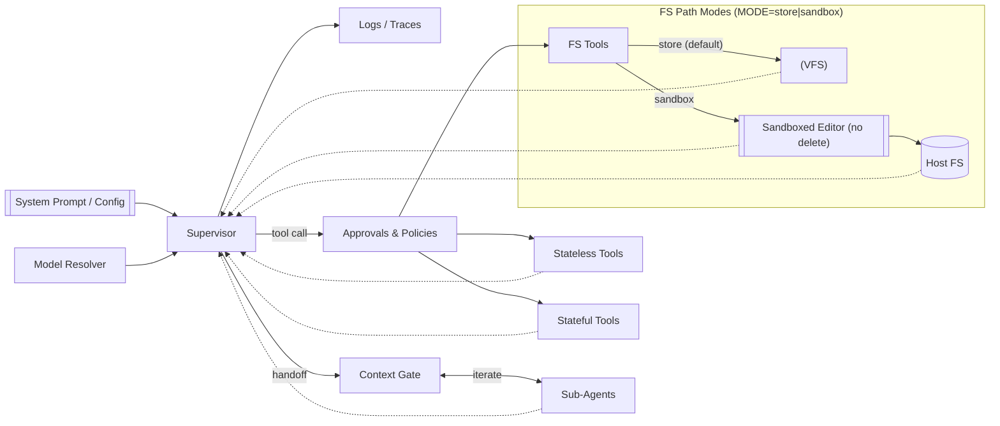

# deepagents
> Inspect-AI-native, CLI-first agents with typed state, tools, and rich traces.


[](https://github.com/cnm13ryan/deepagents/actions)
[](https://github.com/cnm13ryan/deepagents/actions)
[](https://app.codecov.io/gh/cnm13ryan/deepagents)
[](LICENSE)
[](https://pypi.org/project/deepagents/)
[](https://pypi.org/project/deepagents/)
[](https://github.com/cnm13ryan/deepagents/commits/inspect-ai-rewrite)

## Why deepagents?
Setting up practical LLM agents is slow: you fight glue code, logging, state, and tool orchestration. deepagents removes the overhead with an Inspect-AI-native, CLI-first workflow: one command to run; typed state (todos/files); built-in tools; transcripts and traces by default. Ship in minutes, not days.

## Key Features
- ✅ **CLI-first**: One command to run an agent or eval with Inspect
- ✅ **Inspect-native tools**: Todos + virtual filesystem (store or sandbox)
- ✅ **Optional standard tools**: Think, web_search, bash/python, web_browser, text_editor
- ✅ **Typed state**: Simple, explicit models backed by Inspect Store
- ✅ **Sub-agents**: Choose "handoff" (iterative control-flow) or "tool" (single-shot)
- ✅ **Traces & transcripts**: Rich logs and JSONL artifacts out of the box
- ✅ **Safe by default**: Approvals, quarantine filters, and sandbox file operations
- ✅ **Works offline**: Guaranteed "toy" example to validate setup in seconds

## High-level Architecture


Fallbacks: see `docs/diagrams/architecture_overview.png` and source `docs/diagrams/architecture_overview.mmd`.
Figure: DeepAgents control and data flow with filesystem routing. Read left‑to‑right: System Prompt/Config and Model Resolver steer the Supervisor, which logs outputs,
invokes tools through optional Approvals & Policies, and coordinates iterative handoffs via a Context Gate to Sub‑Agents. File operations travel through FS Tools and
are routed by INSPECT_AGENTS_FS_MODE to VFS (default “store”) or, in “sandbox”, through a sandboxed editor bridge to the Host FS (deletes disabled); results return to
the Supervisor. Solid lines denote control/invocation; dashed lines denote data/outputs.

## Installation

### Prerequisites
- **Python**: 3.11 or later (tested on 3.12)
- **OS**: macOS or Linux

### Using uv (Recommended)
```bash
# Set cache directory (avoids re-downloading in restricted environments)
export UV_CACHE_DIR=.uv-cache

# Install dependencies
uv sync

# Verify installation
uv run python -c "import inspect_agents; print('deepagents OK')"
```

### Using pip/venv
```bash
# Create and activate virtual environment
python3.11 -m venv .venv
source .venv/bin/activate

# Install in editable mode
pip install -e .

# Verify installation
python -c "import inspect_agents; print('deepagents OK')"
```

## Quick Start

### Offline Test (No API Keys Required)
Create and run a toy agent to verify your setup:

```python
# quickstart_toy.py
import asyncio
from inspect_ai.agent._agent import AgentState, agent
from inspect_ai.model._chat_message import ChatMessageAssistant
from inspect_agents.agents import build_supervisor
from inspect_agents.run import run_agent

@agent
def toy_submit_model():
    async def execute(state: AgentState, tools):
        state.messages.append(
            ChatMessageAssistant(
                content="",
                tool_calls=[{"id": "1", "function": "submit", "arguments": {"answer": "DONE"}}],
            )
        )
        return state
    return execute

async def main():
    sup = build_supervisor(prompt="You are helpful.", tools=[], attempts=1, model=toy_submit_model())
    result = await run_agent(sup, "hello")
    print("Completion:", result.output.completion)

asyncio.run(main())
# Expected output: "Completion: DONE"
```

### CLI Usage
Basic evaluation with built-in tools:
```bash
uv run inspect eval examples/inspect/prompt_task.py -T prompt="Write a concise overview of LangGraph"
```

With optional tools enabled:
```bash
# Enable structured thinking
INSPECT_ENABLE_THINK=1 uv run inspect eval examples/inspect/prompt_task.py -T prompt="..."

# Enable web search (requires API key)
INSPECT_ENABLE_WEB_SEARCH=1 TAVILY_API_KEY=... uv run inspect eval examples/inspect/prompt_task.py -T prompt="..."
```

For prompts with special characters, use single quotes:
```bash
uv run inspect eval examples/inspect/prompt_task.py \
  -T 'prompt="Identify research about: Cultural traditions and scientific processes"'
```

### Provider Examples
```bash
# LM Studio
uv run python examples/inspect/run.py --provider lm-studio --model local-model "Your prompt"

# Ollama
uv run python examples/inspect/run.py --provider ollama --model llama3.1:8b "Your prompt"

# OpenAI (requires OPENAI_API_KEY)
uv run python examples/inspect/run.py --provider openai --model gpt-4o-mini "Your prompt"
```

### Advanced example (sub‑agents: handoff vs tool)
Declare sub‑agents in YAML and build them programmatically:
```yaml
# inspect.yaml
supervisor:
  prompt: |
    You are a helpful supervisor. Use sub‑agents when appropriate.
subagents:
  - name: researcher
    description: Focused web researcher that plans and cites sources
    prompt: |
      Research the user’s query. Plan, browse, then draft findings.
    mode: handoff
    tools: [web_search, write_todos, read_file, write_file]
    limits:
      - type: time     # 60s max
        seconds: 60
      - type: messages # cap message turns
        max: 8
      - type: tokens   # cap tokens
        max: 6000
    context_scope: scoped          # quarantine: strict|scoped
    include_state_summary: true    # JSON summary of todos/files
  - name: summarizer
    description: Five concise bullets from provided text
    prompt: |
      Summarize the given content in exactly five bullets.
    mode: tool
    tools: []
```

```python
from inspect_agents.config import load_and_build
from inspect_agents.run import run_agent
import asyncio, yaml

cfg = yaml.safe_load(open("inspect.yaml"))
agent, tools, approvals = load_and_build(cfg)
result = asyncio.run(run_agent(agent, "start", approval=approvals))
print(getattr(result.output, "completion", "[no completion]"))
```

Read the Sub‑agent Recipes guide for patterns and quarantine tips: `docs/guides/subagents.md`.

Alternative: convenience runner with provider flags and transcript output:
```bash
# LM Studio
uv run python examples/inspect/run.py --provider lm-studio --model "${LM_STUDIO_MODEL_NAME:-local-model}" "Write a short overview of LangGraph"

# Ollama
export OLLAMA_MODEL_NAME=llama3.1:8b
uv run python examples/inspect/run.py --provider ollama --model "$OLLAMA_MODEL_NAME" "..."

# OpenAI (requires key)
export OPENAI_API_KEY=...
uv run python examples/inspect/run.py --provider openai --model gpt-4o-mini "..."
```


## Features / Key Selling Points
- ✅ CLI‑first: one command to run an agent or eval with Inspect.
- ✅ Inspect‑native tools: todos + virtual filesystem (store or sandbox).
- ✅ Optional standard tools: think, web_search, bash/python, web_browser, text_editor.
- ✅ Typed state: simple, explicit models backed by Inspect Store.
- ✅ Sub‑agents: choose “handoff” (iterative control‑flow) or “tool” (single‑shot).
- ✅ Traces & transcripts: rich logs and JSONL artifacts out of the box.
- ✅ Safe by default: approvals, quarantine filters, and sandbox file operations.
- ✅ Works offline: guaranteed “toy” example to validate setup in seconds.

## Project Status & Roadmap
- Current version: repo 0.0.4; latest on PyPI: 0.0.5. Status: Beta.
- Milestones and planning: see GitHub Milestones and Projects.
  - Milestones: https://github.com/cnm13ryan/deepagents/milestones
  - Projects: https://github.com/cnm13ryan/deepagents/projects
- What’s next (high‑level):
  - CI workflows (tests, lint, coverage) and release automation
  - Expanded examples for web_browser and sandboxed exec
  - Additional sub‑agent templates (researcher, coder, editor)
- Compatibility notes:
  - Python 3.11+ (tested on 3.12)
  - For local Inspect‑AI source dev/tests, set `PYTHONPATH=src:external/inspect_ai/src`

Open Questions (tracked in docs): `docs/open-questions.md`

## Contributing
- Start here: CONTRIBUTING.md (see repository root).
- Code of Conduct: CODE_OF_CONDUCT.md (add if missing).
- Quick start for contributors:
  ```bash
  # venv
  python3.11 -m venv .venv && source .venv/bin/activate
  pip install -e '.[dev,testing,utilities]'
  # ensure local Inspect‑AI src is visible for tests
  export PYTHONPATH=src:external/inspect_ai/src
  pytest -q tests/unit/inspect_agents
  ruff check && ruff format
  ```
- Bugs & features: open an Issue with repro steps or a focused proposal.

## Community & Support
- Questions and ideas: GitHub Discussions (enable if not active)  
  https://github.com/cnm13ryan/deepagents/discussions
- Getting started guide: docs/getting-started/inspect_agents_quickstart.md
- Examples: examples/inspect/
- Maintainers: open an Issue if you need to reach us privately.

## License & Acknowledgments
- Licensed under MIT. See LICENSE.
- Thanks to the Inspect‑AI project and ecosystem for the agent runtime, tools, and logging model.
- Inspiration: CLI‑first DX from projects like Bun and Supabase; awesome‑readme best practices.
