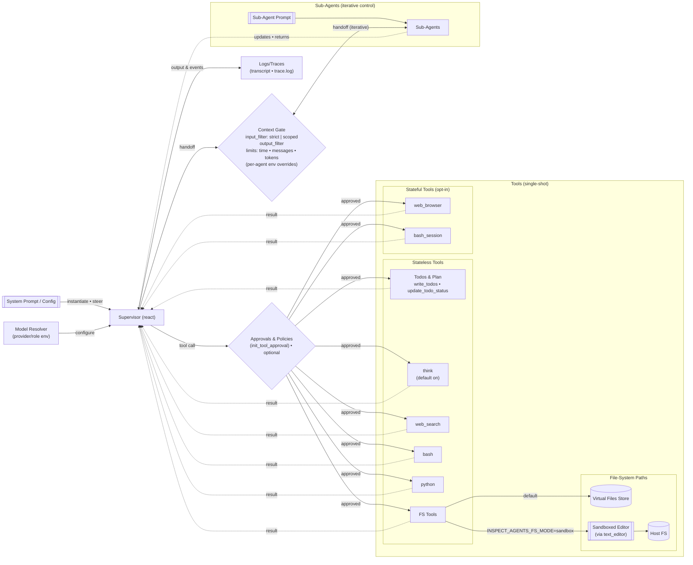

# Architecture (Detailed)

This expands on the high‑level picture in `README.md` with tool modes, state, and filesystem behavior. Rendered by GitHub or any Markdown renderer with Mermaid enabled.

## Notes
- Keep this as the single source for the detailed diagram. Link here from `README.md` to avoid duplication.
- If your docs site doesn’t render Mermaid, export a PNG/SVG from this source and store under `docs/diagrams/` alongside the `.mmd` source.
